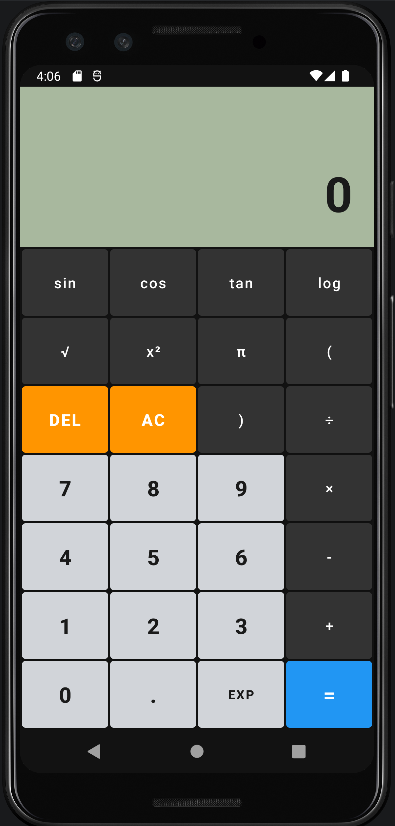
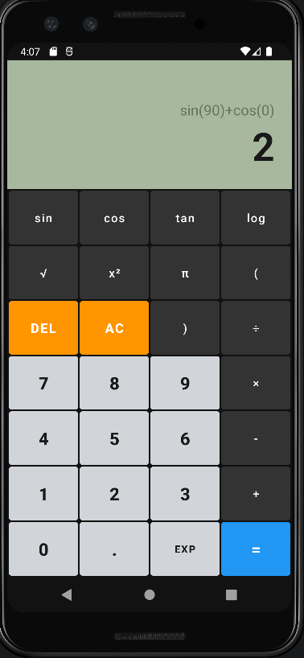

# Calculadora Científica

Este projeto é uma calculadora científica para Android desenvolvida com Kotlin. Inspirado em modelos clássicos: calculadora Casio. 

## Design e Visual

O visual foi pensado para ser o mais proximo da calculadora científica comum:
- O corpo da calculadora usa um tom cinza escuro;
- O visor simula um LCD antigo em verde oliva;
- Os botões são separados por cores: os números em prata, as funções em cinza escuro, os botões de apagar em laranja e o botão de igual em azul.

## Funções Matemáticas
- Cálculos básicos: soma, subtração, multiplicação e divisão;
- Trigonometria: seno, cosseno e tangente;
- Logaritmos e raízes quadradas;
- Constante Pi e cálculos de potência ao quadrado;
- Função EXP para lidar com notação científica.

## Diferenciais de Lógica
- Você pode digitar a conta inteira com parênteses e ela resolve seguindo a ordem correta da matemática.
- O resultado tem uma precisão de até 9 casas decimais;
- O botão DEL apaga o último número digitado.

---------------------------------------------------------------------------------------------
|||
---------------------------------------------------------------------------------------------