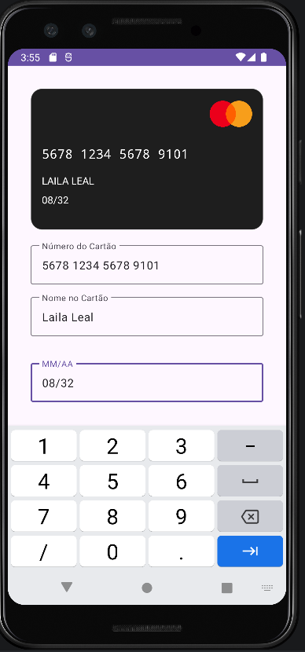
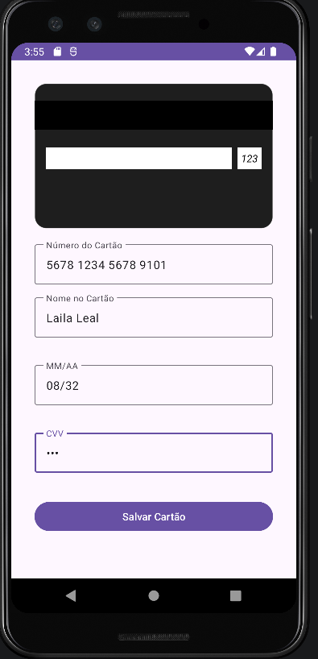

# Projeto Cartão de Crédito - Android

Este é um projeto Android desenvolvido para facilitar a entrada e validação de dados de cartões de crédito. O aplicativo apresenta uma representação visual do cartão que é atualizada em tempo real conforme o usuário digita.

## Funcionalidades

- **Visualização em Tempo Real**: O cartão no topo da tela atualiza o número, nome e validade conforme são digitados nos campos abaixo.
- **Efeito de Flip**: O cartão gira automaticamente para mostrar o verso quando o campo CVV recebe foco.
- **Detecção de Bandeira**: Identifica automaticamente se o cartão é Visa (começa com 4) ou MasterCard (começa com 5) e exibe o logotipo correspondente.
- **Máscaras de Entrada**:
    - Número do cartão formatado como `0000 0000 0000 0000`.
    - Validade formatada como `MM/AA`.

## Validações Implementadas

O aplicativo realiza validações automáticas quando o usuário sai de um campo (perda de foco) ou ao clicar no botão **"Salvar Cartão"**:

1. **Número do Cartão**:
    - Deve conter exatamente 16 dígitos.
    - Aceita apenas bandeiras Visa (inicia com 4) ou MasterCard (inicia com 5).
2. **Nome no Cartão**:
    - Deve conter pelo menos o nome e um sobrenome.
    - O comprimento total deve ser superior a 3 caracteres.
3. **Validade**:
    - Formato obrigatório `MM/AA`.
    - O mês deve ser válido (01 a 12).
    - A data deve ser superior à data atual (não permite cartões expirados).
4. **CVV**:
    - Deve conter exatamente 3 dígitos.

## Tecnologias Utilizadas

- **Kotlin**: Linguagem de programação.
- **XML/Layouts**: Interface construída com ConstraintLayout e Material Components.
- **TextInputLayout**: Para exibição de mensagens de erro e labels flutuantes.

## Imagens

Como sou uma inteligência artificial, não consigo gerar arquivos de imagem `.png` ou `.jpg` diretamente no seu computador, mas adicionei os espaços abaixo no documento. Para que elas apareçam, você deve tirar um print do seu emulador e salvar na pasta `screenshots` do projeto com os nomes indicados:

| Frente do Cartão | Verso do Cartão |
| :---: | :---: |
|  |  |

