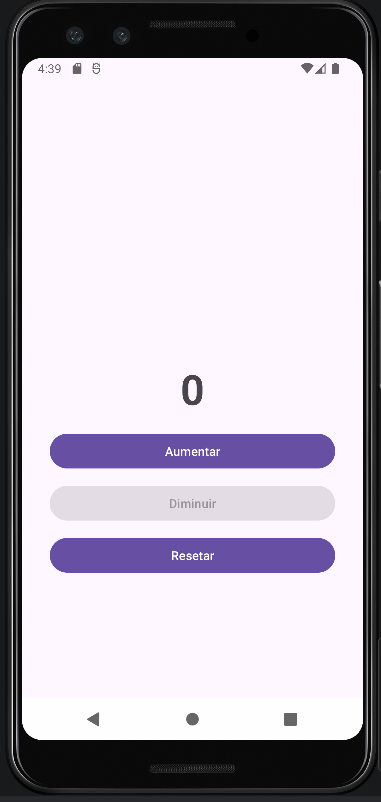

# PROGRAMACAO_MOBILE

# Aplicativo Contador – Android (Kotlin)

## Descrição do Projeto
Este projeto consiste no desenvolvimento de um aplicativo Android simples chamado **Contador**, criado no Android Studio utilizando a linguagem **Kotlin** e interface desenvolvida com **ConstraintLayout**.

O aplicativo permite ao usuário controlar um valor numérico por meio de botões, aplicando regras de negócio para garantir um funcionamento correto e intuitivo.

---

## Funcionalidades Implementadas

- Exibição de um contador numérico centralizado na tela, iniciando em **0**
- Botão **Aumentar**: incrementa o contador em uma unidade a cada clique
- Botão **Diminuir**: decrementa o contador em uma unidade, sem permitir valores negativos
- Desativação automática do botão **Diminuir** quando o contador está em zero
- Botão **Resetar**: retorna o contador para zero
- Exibição de um **AlertDialog de confirmação** ao tentar resetar o contador
- Controle de estado dos botões para garantir a regra de negócio
- Interface organizada e responsiva utilizando ConstraintLayout

---

