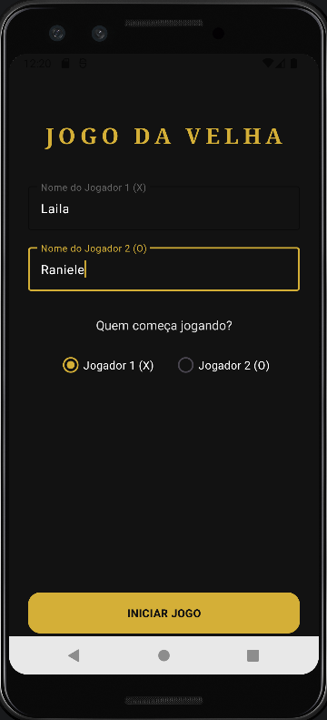
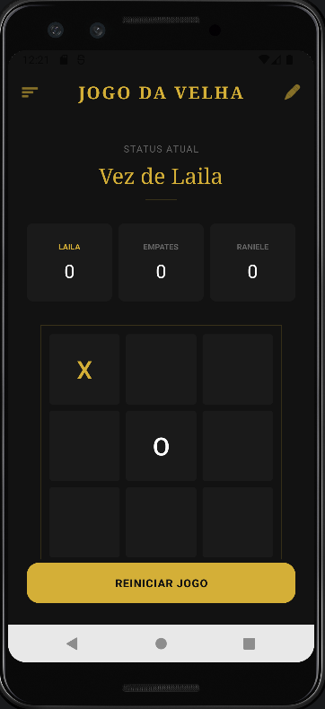
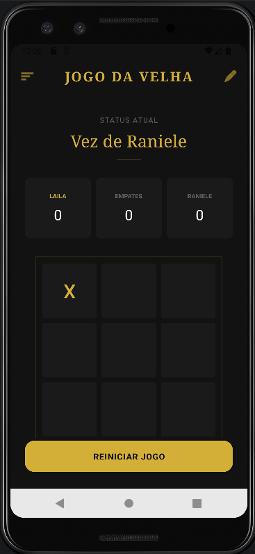
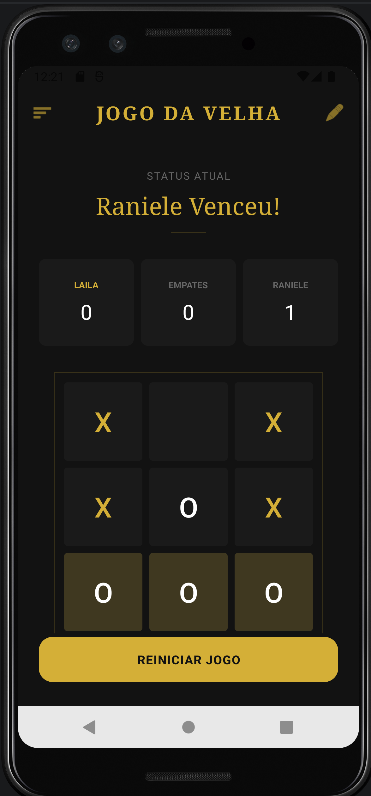

# Jogo da Velha 

Este é um aplicativo Android simples de Jogo da Velha, desenvolvido com foco em experiência do usuário (UX).

## O Aplicativo

- O projeto foi desenvolvido em Kotlin na IDE Android Studio.  
---

## Funcionalidades

- **Personalização de Jogadores:** Permite definir nomes personalizados para os jogadores X e O antes de iniciar a partida.
- **Placar em Tempo Real:** Contador de vitórias para cada jogador e histórico de empates, mantendo o espírito competitivo.
- **Indicador de Turnos:** Exibe claramente qual jogador deve realizar a próxima jogada.
- **Destaque de Vitória:** Quando um jogador vence, a linha, coluna ou diagonal vencedora é destacada visualmente no tabuleiro.
- **Reinicialização Rápida:** Botão dedicado para limpar o tabuleiro e iniciar uma nova rodada mantendo o placar.
- **Design Responsivo:** Interface adaptável que garante boa visualização em diferentes tamanhos de tela.

---

## Diferenciais

- **Interface Moderna:** Foge do visual padrão do Android, utilizando cores customizadas (#121212 e #D4AF37) e bordas arredondadas.
- **Identidade Visual:** Uso de fontes serifadas e espaçamento de letras (letter spacing) para um toque de elegância.
- **Feedback Visual:** Botões interativos que mudam de cor conforme o jogador (Dourado para X, Branco para O).

---

## Screenshots

Aqui estão alguns registros da interface do aplicativo:

| Tela Inicial |                Vez do Jogador 1                 |
| :---: |:-----------------------------------------------:|
|  |  |

|                Vez do Jogador 2                 | Vitória de Partida |
|:-----------------------------------------------:| :---: |
|  |  |

---

