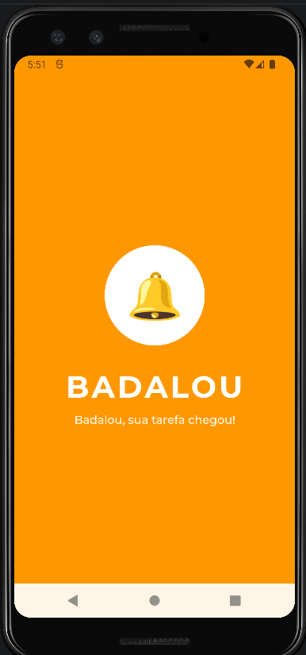
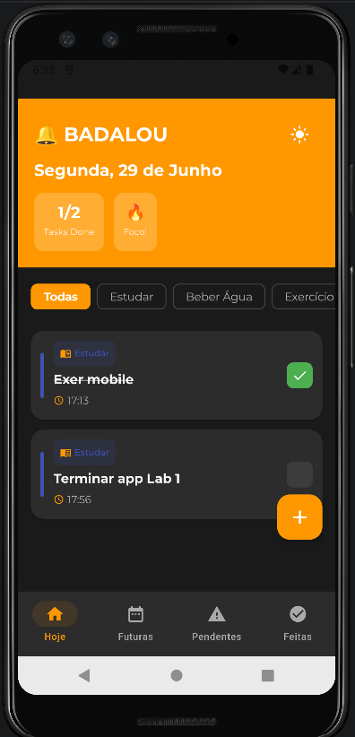
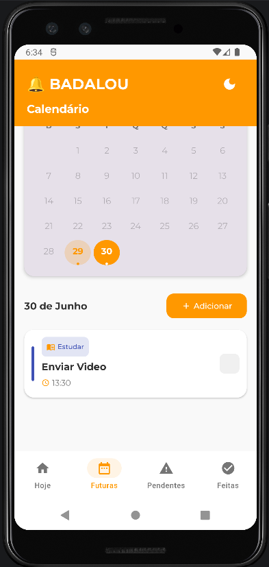
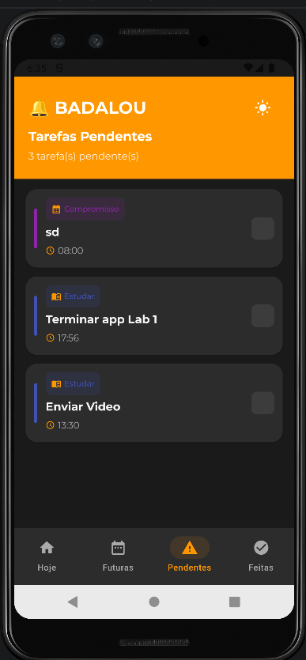
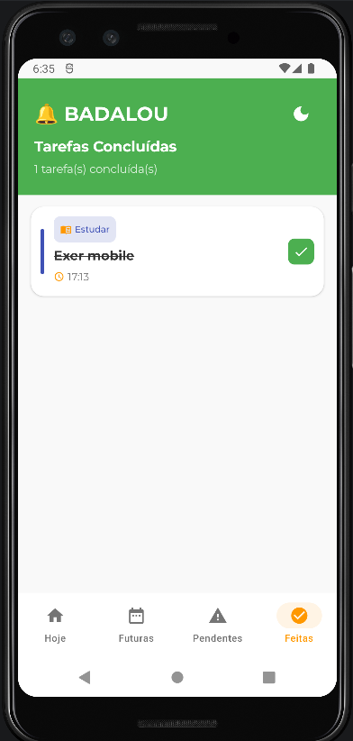
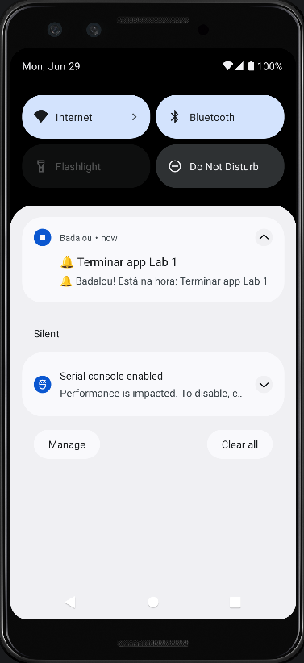

# 🔔 BADALOU

> **"Badalou, sua tarefa chegou!"**

[](https://kotlinlang.org/)
[](https://developer.android.com/jetpack/compose)
[](https://developer.android.com/training/data-storage/room)
[](https://opensource.org/licenses/MIT)

---

## 📝 Descrição do Projeto

O **Badalou** é um aplicativo de lista de tarefas (To-Do) desenvolvido especialmente para auxiliar pessoas que lidam com a procrastinação e o **TDAH**. 

Diferente de listas comuns que acabam esquecidas, o objetivo principal do Badalou é garantir que o usuário seja lembrado de suas responsabilidades no momento exato. Através de um sistema de notificações locais robusto, o app atua como um despertador de produtividade, ajudando a manter o foco e a organização do dia a dia.

---

## ✨ Funcionalidades

- ✅ **Gerenciamento de Tarefas:** Cadastro, edição e exclusão intuitiva de tarefas.
- 🏷️ **Categorização Inteligente:** Organize-se com categorias como *Estudar*, *Beber Água*, *Exercício*, *Medicamento* e *Compromisso*.
- ⏰ **Notificações Precisas:** Sistema integrado com `AlarmManager` e `WorkManager` para garantir que a notificação chegue no horário agendado, mesmo com o aplicativo fechado.
- 🌓 **Tema Adaptativo:** Suporte completo a Tema Claro e Escuro, com a preferência do usuário salva via `DataStore`.
- 📅 **Calendário Integrado:** Visualize e agende tarefas para datas futuras com uma interface de calendário dedicada.
- 🗂️ **Navegação por Abas:**
    - **Hoje:** Suas prioridades do momento.
    - **Futuras:** Planejamento a longo prazo via calendário.
    - **Pendentes:** O que ainda precisa de atenção.
    - **Concluídas:** Histórico de produtividade.
- 💾 **Persistência Local:** Seus dados ficam salvos de forma segura no dispositivo usando `Room Database`.

---

## 🚀 Tecnologias Utilizadas

O projeto utiliza as tecnologias mais modernas recomendadas para o desenvolvimento Android nativo:

- **Linguagem:** [Kotlin](https://kotlinlang.org/)
- **UI:** [Jetpack Compose](https://developer.android.com/jetpack/compose) (Declarative UI)
- **Design:** [Material Design 3](https://m3.material.io/)
- **Banco de Dados:** [Room](https://developer.android.com/training/data-storage/room) (Abstração SQLite)
- **Agendamento:** [AlarmManager](https://developer.android.com/training/scheduling/alarms) & [WorkManager](https://developer.android.com/topic/libraries/architecture/workmanager)
- **Persistência de Preferências:** [DataStore Preferences](https://developer.android.com/topic/libraries/architecture/datastore)
- **Arquitetura:** MVVM (Model-View-ViewModel)
- **Assincronismo:** Coroutines e Flow

---

## 🏗️ Arquitetura do Projeto

O código está organizado seguindo padrões de Clean Code e separação de responsabilidades:

```text
com.laila.badalou/
├── data/
│   ├── database/     # Entidade Tarefa, DAO e configuração do Room.
│   ├── repository/   # Padrão Repository para mediação de dados.
├── ui/
│   ├── screens/      # Telas (Home, Calendário, Add/Edit).
│   ├── components/   # Componentes reutilizáveis (TaskCard, BottomNavBar).
│   ├── viewmodel/    # Lógica de negócio e estado da UI.
│   ├── theme/        # Definições de cores, fontes e temas (Material3).
├── worker/           # Lógica de agendamento e exibição de notificações.
```

---

## 📸 Screenshots

Aqui estão algumas prévias da interface do **Badalou**:

| Splash Screen | Início (Dark Mode) | Calendário (Light) |
|:---:|:---:|:---:|
|  |  |  |

| Pendentes (Dark) | Concluídas (Light) | Notificações |
|:---:|:---:|:---:|
|  |  |  |

> *Acompanhamento visual do seu progresso diário e lembretes que não te deixam esquecer o que importa.*

---

## 🛠️ Como Executar o Projeto

Para rodar o Badalou localmente, siga os passos abaixo:

### Pré-requisitos
- [Android Studio Ladybug](https://developer.android.com/studio) ou superior.
- Java Development Kit (JDK) 17.
- Dispositivo Android ou Emulador com API 24 (Android 7.0) ou superior.

### Passo a passo
1. Clone este repositório:
   ```bash
   git clone https://github.com/seu-usuario/badalou.git
   ```
2. Abra o projeto no **Android Studio**.
3. Aguarde a sincronização do **Gradle**.
4. Clique no botão **Run** (ícone de play verde) para instalar no dispositivo/emulador.

---

## 👤 Autor

Desenvolvido com ❤️ por **Laila Leal**.

---
*Este projeto foi criado como parte de estudos de desenvolvimento mobile com foco em acessibilidade e produtividade.*
