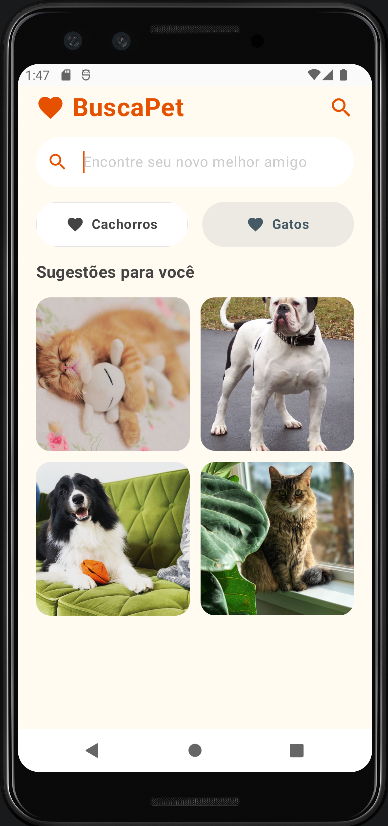
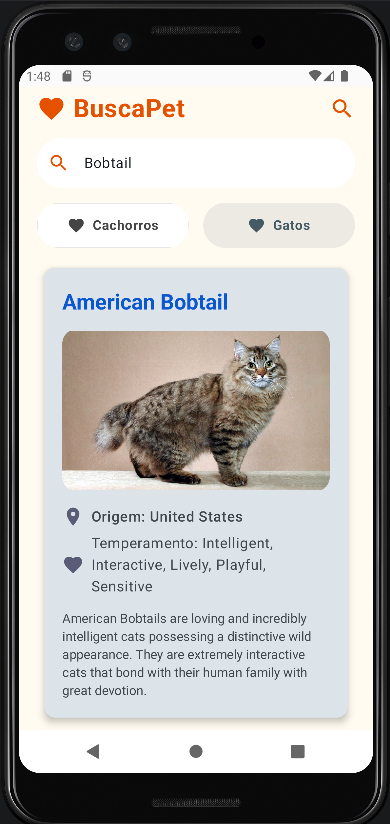
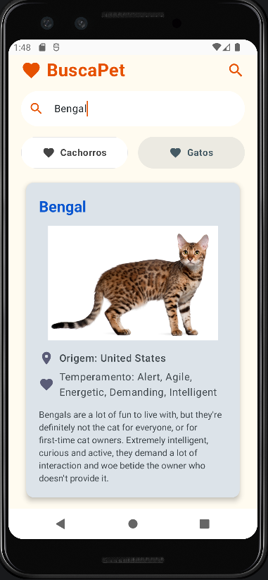
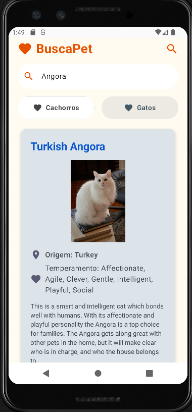
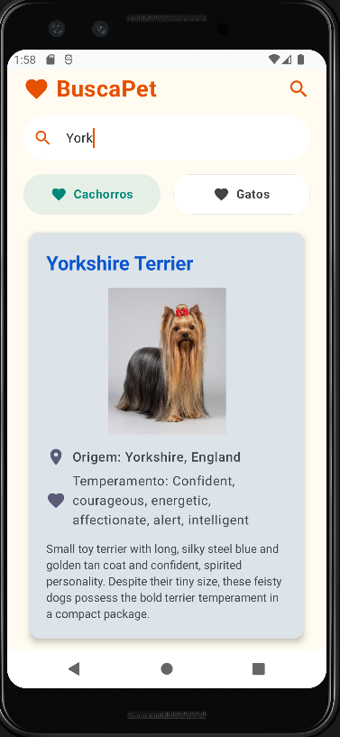
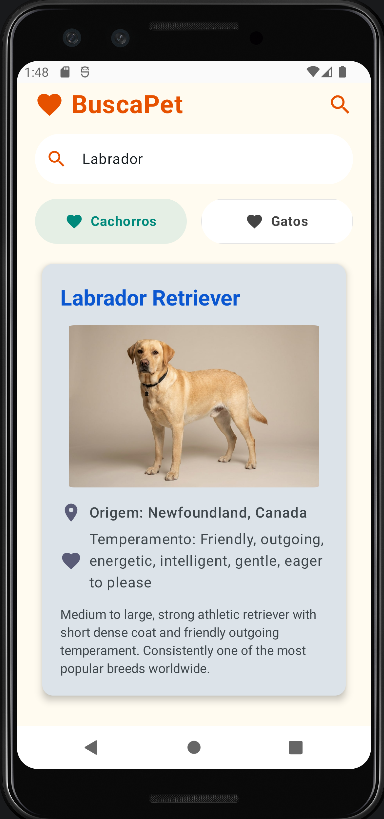
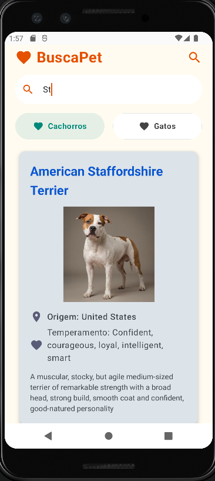

# 🐾 BuscaPet - Cat & Dog Explorer

O **BuscaPet** é um aplicativo Android desenvolvido para a exploração de raças de gatos e cachorros. 
Através de uma interface intuitiva e dinâmica, o usuário pode pesquisar raças  específicas, visualizar 
fotos e conhecer como origem, temperamento e descrições detalhadas.

---

## Interface da Aplicação

### Tela Inicial e Sugestões
<p align="center">
  
</p>

### Pesquisa de Gatos
<p align="center">
  
  
  
</p>

### Pesquisa de Cachorros
<p align="center">
  
  
  
</p>

---

## Funcionalidades

- **Busca Dinâmica:** Pesquise raças em tempo real com sugestões automáticas.
- **Filtro de Espécie:** Alterne facilmente entre o universo dos felinos e caninos.
- **Fotos Aleatórias:** Descubra novos pets logo na tela inicial com sugestões variadas.
- **Informações Detalhadas:** Dados completos sobre a origem, comportamento e história de cada raça.
-  **Tratamento de Erros:** Gestão inteligente de estados de carregamento, falhas de rede e resultados vazios.

---

## Tecnologias Utilizadas

Este projeto foi construído utilizando as seguintes tecnologias:

- **Linguagem:** [Kotlin](https://kotlinlang.org/)
- **UI:** [Jetpack Compose](https://developer.android.com/jetpack/compose) (Interface declarativa)
- **Arquitetura:** MVVM (Model-View-ViewModel) com StateFlow
- **Consumo de API:** [Retrofit](https://square.github.io/retrofit/) & OkHttp
- **Processamento de Imagens:** [Coil](https://coil-kt.github.io/coil/) (Carregamento assíncrono)
- **Concorrência:** Kotlin Coroutines & Flow
- **Serialização:** Kotlinx Serialization

---

## APIs Consumidas

O aplicativo integra duas das APIs de pets mais populares do mundo:
1. **[TheCatAPI](https://thecatapi.com/):** Fornece dados e imagens detalhadas de raças de gatos.
2. **[TheDogAPI](https://thedogapi.com/):** Fornece dados e imagens detalhadas de raças de cachorros.

---

## Como Executar o Projeto

1. **Clonar o Repositório:**
   ```bash
   git clone https://github.com/seu-usuario/Prova1_API_catdog.git
   ```

2. **Abrir no Android Studio:**
   - Recomenda-se a versão mais recente do Android Studio.

3. **Configuração de API Keys (Opcional):**
   - As chaves já estão configuradas no arquivo `RetrofitInstance.kt`. Caso queira usar as suas próprias, basta substituí-las lá.

4. **Rodar o App:**
   - Selecione um emulador (API 24 ou superior) e clique no botão **Run**.

---

##  Licença

Este projeto foi desenvolvido para fins acadêmicos como parte da disciplina de Programação Mobile.

---
<p"center">Desenvolvido por Laila Leal</p>
