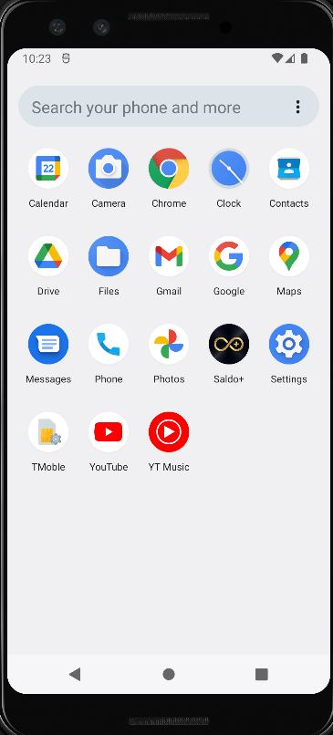
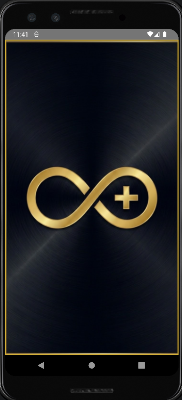
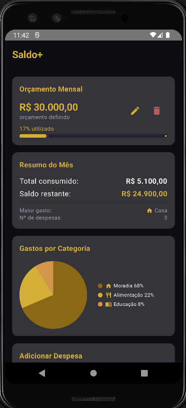
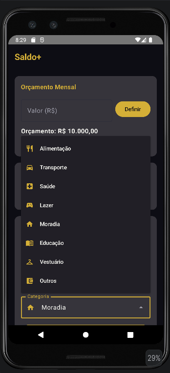

# Saldo+ — Gestão de Finanças Pessoais


O **Saldo+** é um aplicativo de gestão financeira, desenvolvido como projeto acadêmico para a disciplina de **Programação Mobile**. 
O app é focado na experiência do usuário, permitindo um controle de orçamentos e gastos mensais.

---

## Screenshots

| Ícone do App | Splash Screen | Dashboard | Categorias |
|:---:|:---:|:---:|:---:|
|  |  |  |  | 

---

## Funcionalidades Implementadas

### Controle de Orçamento
*   **Definição de Teto:** Defina um orçamento mensal global que fica persistido no banco de dados.
*   **Edição Flexível:** Altere ou resete seu orçamento a qualquer momento através de diálogos intuitivos.
*   **Monitoramento Visual:** Barra de progresso dinâmica que muda de cor conforme o consumo.
*   **Alertas Inteligentes:** Notificações visuais ao atingir 80% (Alerta) e 100% (Limite excedido) do orçamento.

### Gestão de Despesas
*   **Cadastro Detalhado:** Registro de despesas com nome, valor e categoria.
*   **Categorização Especializada:** 8 categorias exclusivas (Alimentação, Transporte, Saúde, Lazer, Moradia, Educação, Vestuário e Outros) com ícones dourados (Material Icons).
*   **Histórico Completo:** Lista de despesas persistente com opção de remoção individual ou limpeza total do histórico.

### Inteligência de Dados
*   **Resumo Executivo:** Visualização imediata do total consumido, saldo restante e identificação automática do maior gasto do mês.
*   **Gráfico de Pizza:** Visualização proporcional dos gastos por categoria, desenvolvido artesanalmente utilizando **Canvas do Compose**.

---

## Arquitetura e Padrões de Projeto

O projeto segue as melhores práticas de desenvolvimento Android moderno:

*   **MVVM (Model-View-ViewModel):** Separação clara entre a lógica de negócio, os dados e a interface do usuário.
*   **Room Database:** Persistência local completa com DAO (Data Access Object), Entities e Database.
*   **Reatividade:** Uso de `StateFlow` e `MutableState` para garantir que a UI reflita as mudanças nos dados instantaneamente.
*   **Navigation Compose:** Sistema de navegação robusto entre a Splash Screen e a Tela Principal.
*   **ViewModelFactory:** Implementação correta para injeção de dependências no ViewModel.

---

## Tecnologias Utilizadas

- **Linguagem:** [Kotlin](https://kotlinlang.org/)
- **UI:** [Jetpack Compose](https://developer.android.com/jetpack/compose) (Material3)
- **Banco de Dados:** [Room Database](https://developer.android.com/training/data-storage/room)
- **Navegação:** Navigation Compose
- **Design:** Material Design 3 (Premium Dark/Gold Theme)
- **Gráficos:** Compose Canvas API

---

## Estrutura do Projeto

```text
app/src/main/java/com/example/financas/
├── model/           # Despesa.kt, Categoria.kt (Enum com ícones)
├── data/            # Entidades, DAOs e Database (Room)
├── viewmodel/       # FinancasViewModel e Factory
├── ui/
│   ├── screens/     # SplashScreen.kt, TelaFinancas.kt, NavGraph.kt
│   ├── theme/       # Color.kt, Theme.kt, Type.kt
│   └── components/  # GraficoPizza.kt, LogoSaldo.kt
```

---

## Como Executar o Projeto

Para rodar o **Saldo+** em seu ambiente de desenvolvimento, siga os passos abaixo:

### Requisitos Mínimos
*   **Android Studio:** Versão Hedgehog (2023.1.1) ou superior.
*   **JDK:** Versão 11 ou superior.
*   **Android SDK:** API 36 (Android SDK 36).
*   **Dispositivo/Emulador:** Android 7.0 (API 24) ou superior.

### Passo a Passo
1.  **Clone o projeto** para sua máquina local.
2.  Abra o **Android Studio** e selecione a pasta do projeto.
3.  Aguarde a sincronização do **Gradle** (ícone de elefante).
4.  Certifique-se de que o emulador está configurado para a **API 24** ou superior.
5.  Clique no botão **Run (Play verde)** para compilar e instalar o app.

---

## Créditos
Este projeto foi desenvolvido como parte integrante da avaliação da disciplina de **Programação Mobile**. 
O foco principal foi aplicar conceitos de persistência local, renderização de gráficos customizados
e design responsivo em Jetpack Compose.
