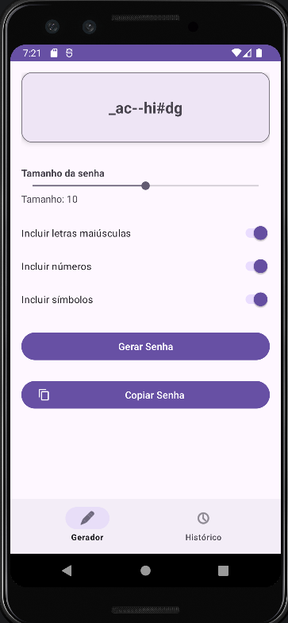
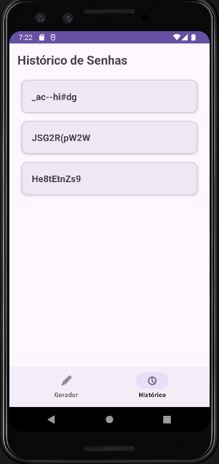

#  Gerador de Senhas com Histórico

Um aplicativo Android desenvolvido em Kotlin que permite gerar senhas, mantendo um histórico das senhas criadas.

##  Funcionalidades

- **Geração de Senha:** Configure o tamanho da senha (através de uma SeekBar) e escolha os critérios:
    - Letras Maiúsculas
    - Números
    - Símbolos
- **Interface:** Exibição da senha em destaque dentro de um `MaterialCardView`.
- **Cópia:** Botão para copiar a senha gerada diretamente para a área de transferência do sistema.
- **Histórico Automático:** Todas as senhas geradas são salvas automaticamente em uma lista organizada.
- **Navegação Fluida:** Barra de navegação inferior (Bottom Navigation) para alternar entre o Gerador e o Histórico.

## Capturas de Tela 
| Gerador                                    | Histórico                              |
|--------------------------------------------|----------------------------------------|
|  |  |

   